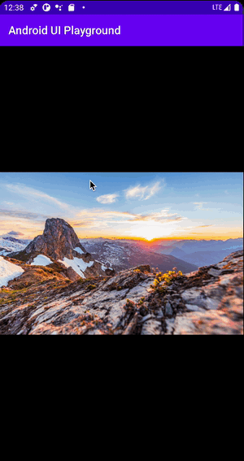
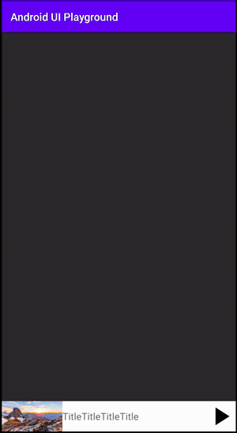

# android-ui-playground
Let's understand ui implementation of android apps in the world

## UI list
### Image preview
Preview UI of image like twitter app

### Youtube Player Animation
Swipe animation of youtube player view using motion layout

